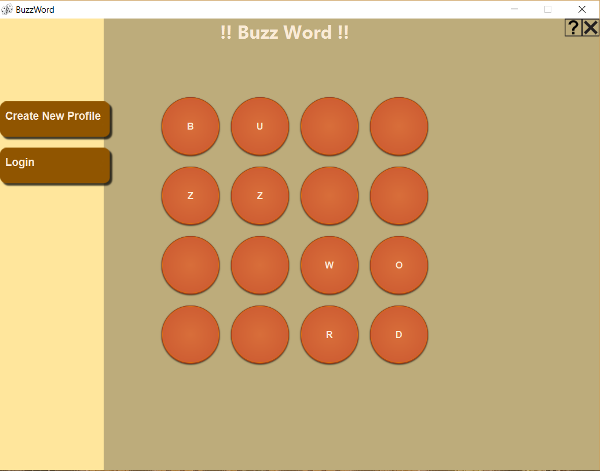
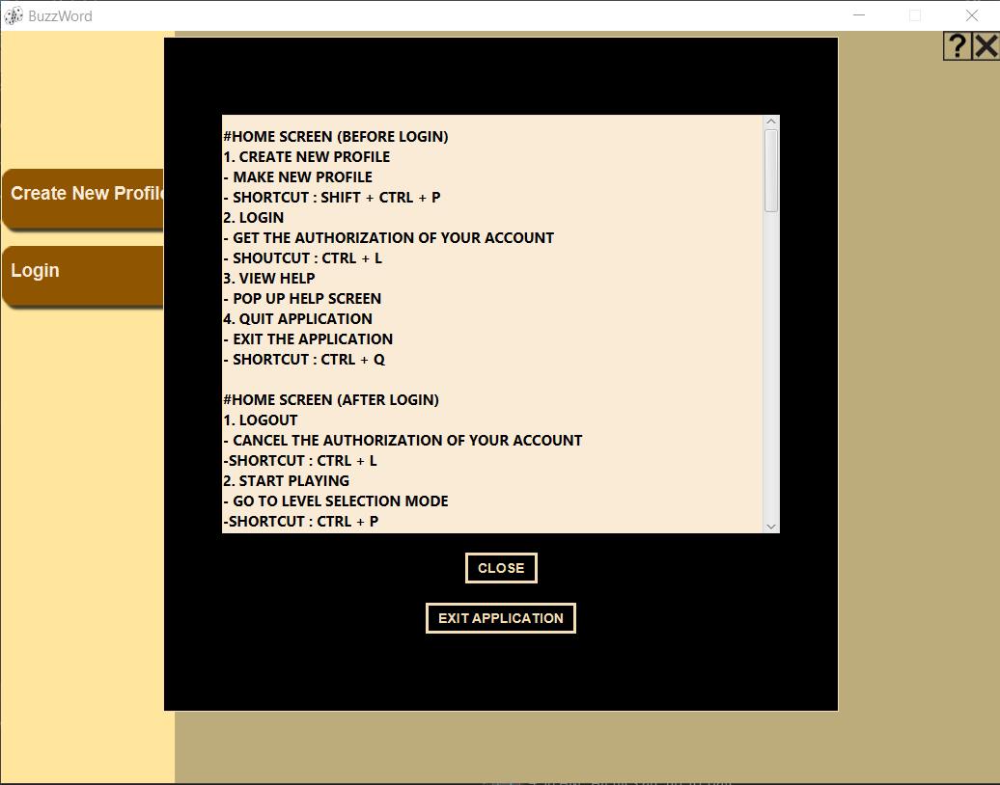
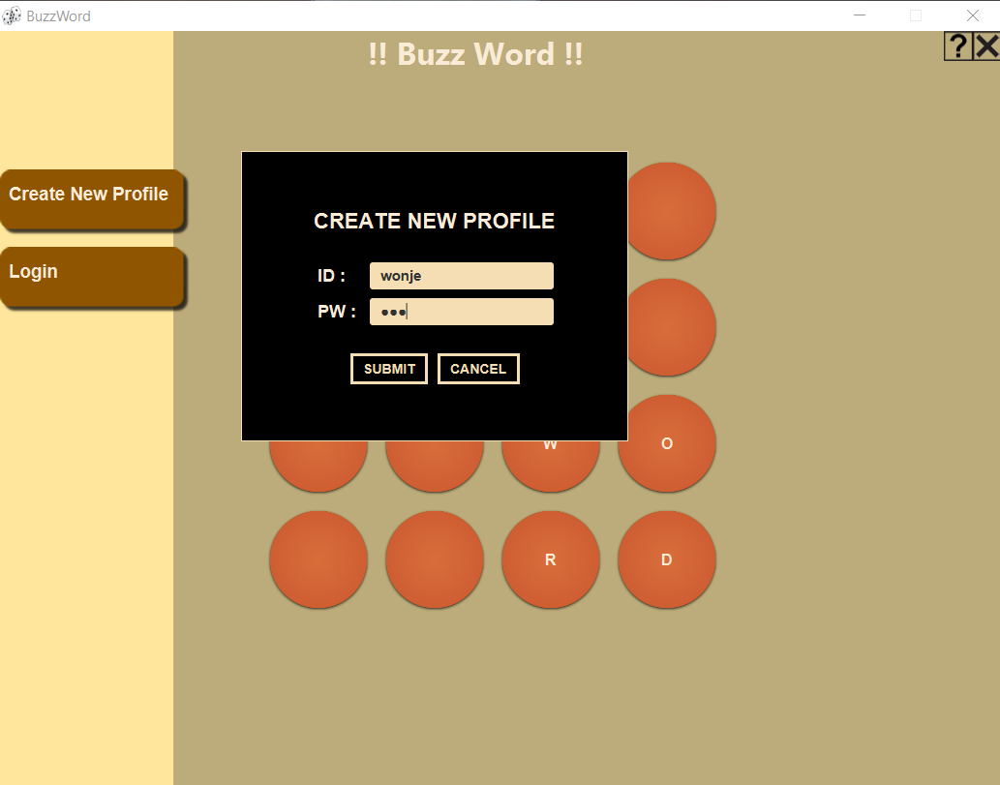
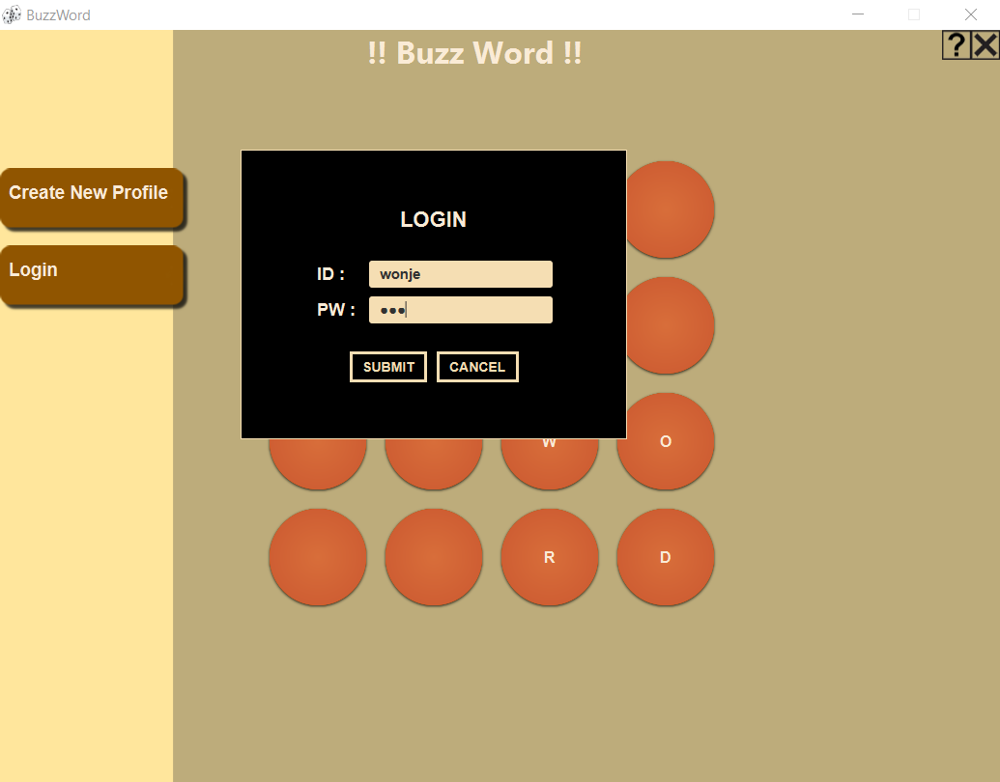
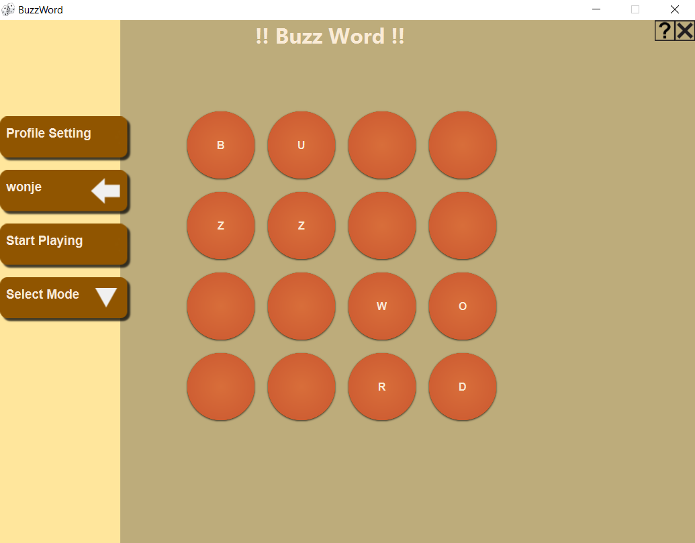
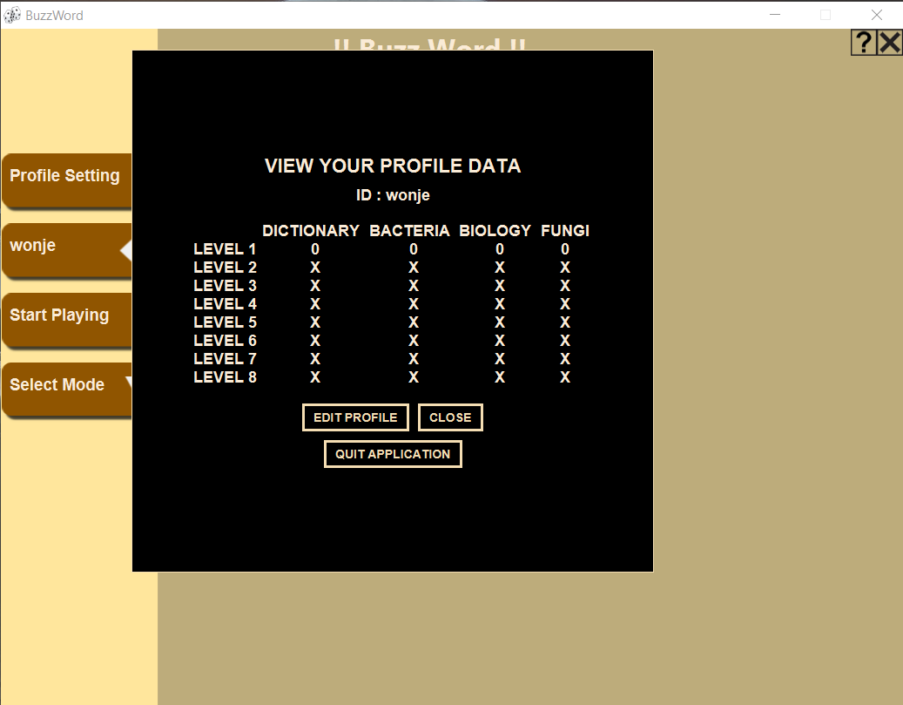
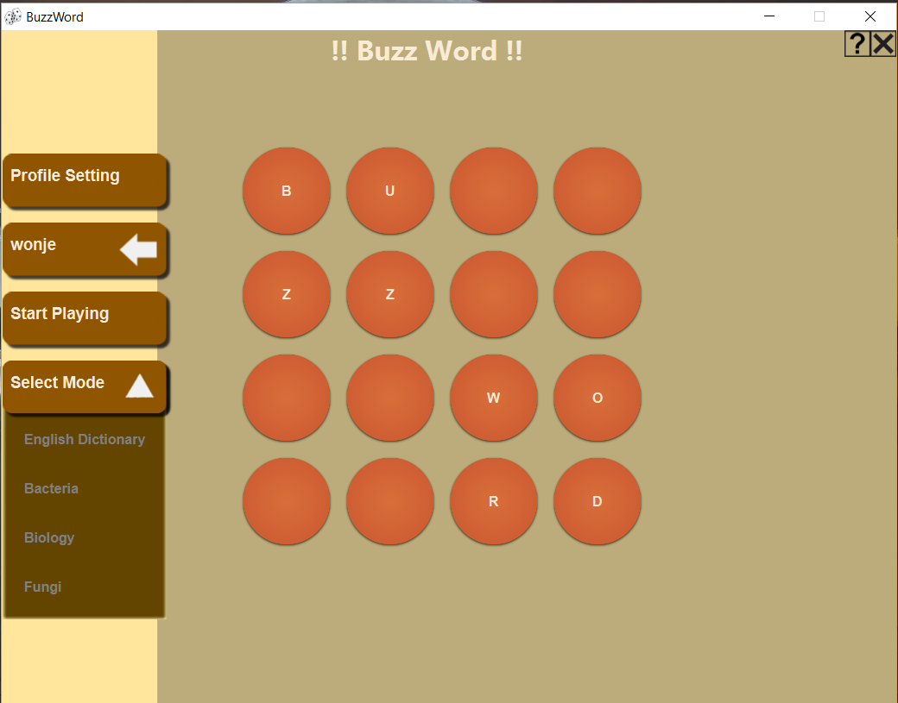
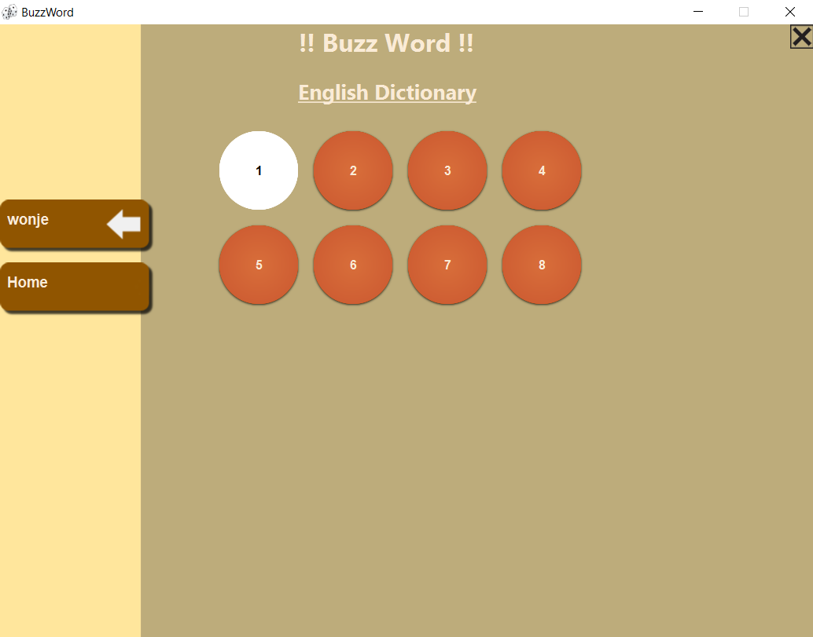
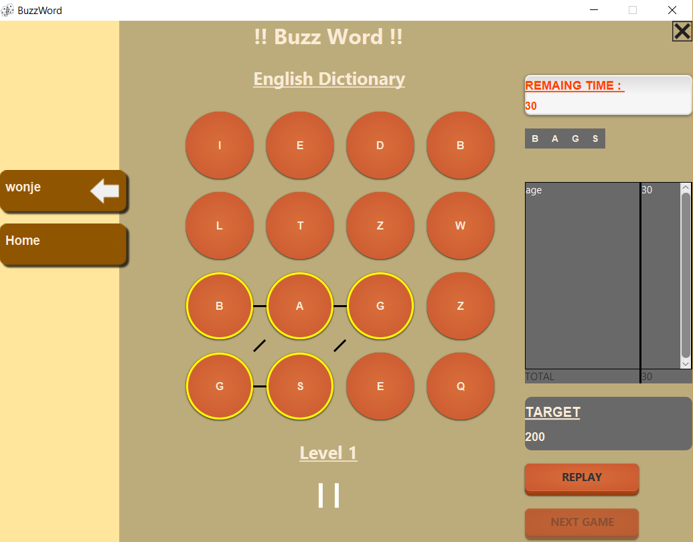
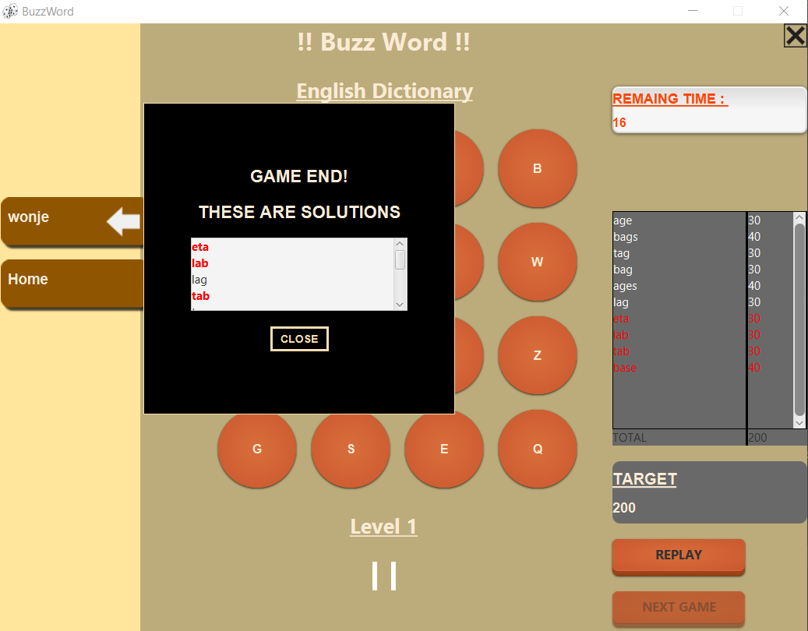

# BuzzWord
This is an individual project in Java language programming class.
"BuzzWord" is English learning game, similar to "Boggle" game.

This project is written in Java with Intellij IDE.
## How to play "BuzzWord"?
```
To execute this program, you may use Intellij IDE.
```
### Step 1 : Main Screen Before Login

```
This is main screen what you see if you execute the program.
```
### Step 2 : Help Screen

```
This is help screen to give instructions for how to play the game.
```
### Step 3 : Create ID

```
This is ID creation step for login.
```
### Step 4 : Login

```
This is login step what you made in last step.
```
### Step 5 : Main Screen After Login

```
This is main screen what you see after login.
```
### Step 6 : View Profile Screen

```
This screen shows player's profile which is scores at each stage.

By clicking "EDIT PROFILE," player can change the password of the logged ID.
```
### Step 7 : Select Mode

```
Player should select mode before starting game.

If player do not select mode, the default mode value, "English Dictionary," should be selected.
```
### Step 8 : Level Selection

```
Player should choose the stage level before starting game.

If player completes each of stages, the next stage will be opened.
```
### Step 9 : Game Play

```
This is screen for playing game.

Player should find English words, related to what player chose at Step 7, in 60 seconds.

Each point is proportioned to the length of solution word.

Player can type keyboard or drag using mouse to find solution word on grids.
```
### Step 10 : Game End

```
This screen is what you see if you complete the stage.
```
